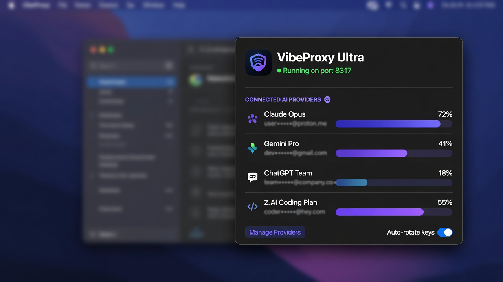

# VibeProxy Ultra

<p align="center">
  
</p>

<p align="center">
<a href="https://github.com/Geekyshubham/vibeproxy-ultra/blob/main/LICENSE"></a>
<a href="https://github.com/automazeio/vibeproxy"></a>
<a href="https://github.com/Geekyshubham/vibeproxy-ultra"></a>
</p>

**VibeProxy Ultra** is an **unofficial enhanced fork** of [VibeProxy](https://github.com/automazeio/vibeproxy) by Automaze, Ltd.

> **Not affiliated with Automaze, OpenAI, Anthropic, Google, xAI, or any AI provider.**  
> Original project: [automazeio/vibeproxy](https://github.com/automazeio/vibeproxy) · Original license: **MIT**

Use your existing Claude Code, ChatGPT/Codex, Gemini, Antigravity, GitHub Copilot, Z.AI GLM, Grok, Kimi, Qwen, OpenCode Go, and related subscriptions with local AI coding tools — **no separate API keys required** for OAuth-based providers.

Built on [CLIProxyAPIPlus](https://github.com/router-for-me/CLIProxyAPIPlus) for OAuth, token management, and API routing.

<p align="center">
  
</p>

---

## What’s new in Ultra

Ultra keeps the native macOS menu bar experience and adds production-oriented account, usage, and session reliability features:

| Area | Ultra improvements |
|------|--------------------|
| **Usage limits** | Live per-account usage cards with streaming updates (results appear as each account finishes, not only after everything is done) |
| **Antigravity** | Separate Gemini Pro/Flash vs Claude/Opus quota groups via Cloud Code `retrieveUserQuota` + `retrieveUserQuotaSummary` |
| **ChatGPT / Codex** | Multi-subscription visibility (e.g. Go vs Team/Enterprise windows) via Codex usage APIs |
| **Z.AI Coding Plan** | Quota limits from `api.z.ai` monitor endpoints (similar to zcode.z.ai) |
| **Account import** | Import configured local accounts for providers (Claude, Codex, Gemini, Antigravity, Z.AI, Copilot, Grok, OpenCode Go, and more) |
| **False expiry fix** | Access-token clock expiry alone no longer marks a session dead when a usable refresh token still exists |
| **Proactive refresh** | Background token refresh with grace window so sessions stay warm |
| **Quota wake** | “Wake 5h” style keep-alive / dummy pings to reduce idle quota window surprises |
| **OpenCode Go** | First-class OpenAI-compatibility provider entry (not hidden as reserved) |
| **Menu bar UX** | Richer popover: server status, accounts, usage refresh, settings entry |

Core VibeProxy capabilities remain: one-click server start/stop, multi-account round-robin, provider enable/disable, Vercel AI Gateway option for Claude, and a self-contained `.app` bundle.

---

## Attribution & license

```text
Based on VibeProxy by Automaze, Ltd., licensed under MIT.
VibeProxy Ultra is an unofficial fork / enhanced version.
Original: https://github.com/automazeio/vibeproxy
```

- Keep the original **MIT** `LICENSE` (Automaze copyright preserved).
- Ultra modifications: **Copyright (c) 2026 Geekyshubham / Shubh**.
- You may use, modify, publish, and distribute under MIT; **do not** remove the original copyright notice.
- Code license ≠ trademarks: do not imply this is the official Automaze product.

See [LICENSE](LICENSE) for the full text.

---

## Important risks (read before using)

| Risk | Notes |
|------|--------|
| **Provider ToS** | Proxying Claude / ChatGPT / Gemini / other subscriptions may violate a provider’s terms depending on use. Use at your own risk. |
| **Branding** | This is **VibeProxy Ultra**, not official VibeProxy. |
| **Secrets** | Never commit OAuth tokens, API keys, or credentials. Auth files live under `~/.cli-proxy-api/` on your machine only. |
| **Dependencies** | Bundled `cli-proxy-api-plus` and third-party libs may have their own licenses — verify before redistribution. |
| **Auto-updates** | Sparkle checks against automazeio feeds are **disabled** in this fork so upstream releases do not overwrite Ultra. |

---

## Features (full list)

- Native SwiftUI macOS menu bar app
- One-click local proxy server management
- OAuth connect flows for major providers + API-key providers (e.g. Z.AI)
- Multi-account support with failover when rate-limited
- Provider priority / enable toggles with hot reload
- **Streaming usage dashboard** per account and quota window
- **Local app account import** for configured provider credentials
- **Proactive token refresh** + **quota wake** keep-alives
- Vercel AI Gateway routing option for Claude
- Dark-mode friendly icons and menu bar status
- Self-contained app bundle (binary + config)

---

## Requirements

- macOS 13.0 (Ventura) or later
- Xcode Command Line Tools / Swift 5.9+ to build from source

## Build from source

```bash
git clone https://github.com/Geekyshubham/vibeproxy-ultra.git
cd vibeproxy-ultra
make app          # creates VibeProxy.app
make run          # build + launch
# or
make install      # install to /Applications
```

See [INSTALLATION.md](INSTALLATION.md) for more detail (paths still refer to the app bundle name `VibeProxy.app`).

## Usage

1. Launch the app — a menu bar icon appears.
2. Click the icon for the **Ultra** popover (status, accounts, usage).
3. Open **Settings** to connect providers, import local accounts, and manage the server.
4. Point coding tools (Factory, Amp, etc.) at the local proxy (default thinking/proxy path uses ports documented in the original setup guides).

Setup guides from upstream still apply conceptually:

- [Factory CLI Setup](FACTORY_SETUP.md)
- [Amp CLI Setup](AMPCODE_SETUP.md)

Replace any `automazeio/vibeproxy` download links with this Ultra repo when installing the fork.

---

## Project structure

```text
vibeproxy-ultra/
├── LICENSE                 # MIT (Automaze + Ultra copyright)
├── README.md
├── Makefile / create-app-bundle.sh
├── src/
│   ├── Package.swift
│   ├── Info.plist
│   ├── Sources/            # SwiftUI app + usage/import/refresh services
│   │   └── Resources/      # cli-proxy-api-plus, config.yaml, icons
│   └── Tests/
└── icon.png                # Ultra app icon
```

Notable Ultra sources:

- `NativeUsageFetcher.swift` / `UsageStore.swift` / `ProviderUsageCardView.swift` — usage limits UI
- `ConfiguredAccountDiscovery.swift` / `ConfiguredAccountImporter.swift` — local account import
- `TokenRefreshService.swift` / `QuotaWakeService.swift` — session reliability
- `MenuBarPanelView.swift` / `MenuBarPopoverController.swift` — enhanced menu bar

---

## Credits

- **Original VibeProxy**: [Automaze, Ltd.](https://automaze.io) — [automazeio/vibeproxy](https://github.com/automazeio/vibeproxy)
- **Proxy engine**: [CLIProxyAPIPlus](https://github.com/router-for-me/CLIProxyAPIPlus) / related CLIProxy ecosystem
- **Ultra fork**: Geekyshubham

## Support

- **Issues (Ultra)**: [Geekyshubham/vibeproxy-ultra](https://github.com/Geekyshubham/vibeproxy-ultra/issues)
- **Upstream project**: [automazeio/vibeproxy](https://github.com/automazeio/vibeproxy)

---

© 2025 Automaze, Ltd. (original VibeProxy)  
© 2026 Geekyshubham (VibeProxy Ultra modifications)  
MIT License — see [LICENSE](LICENSE).
